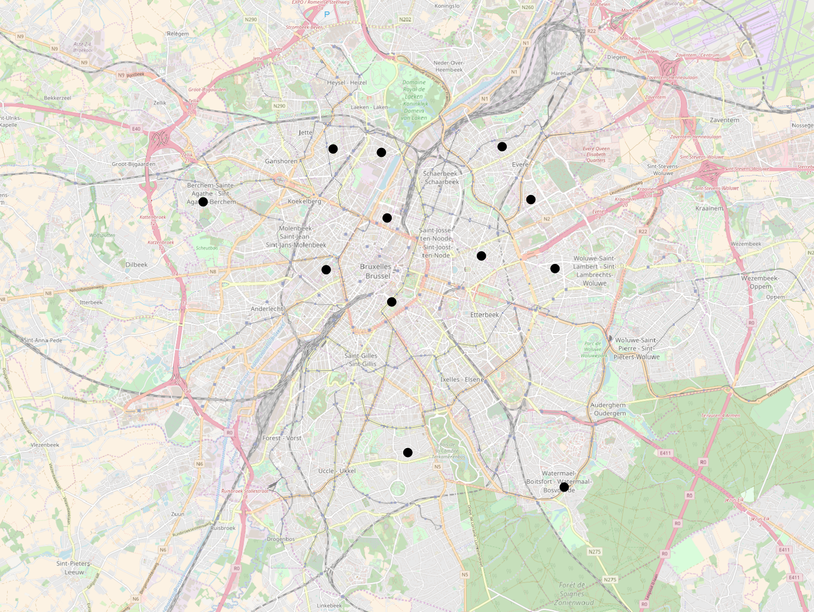
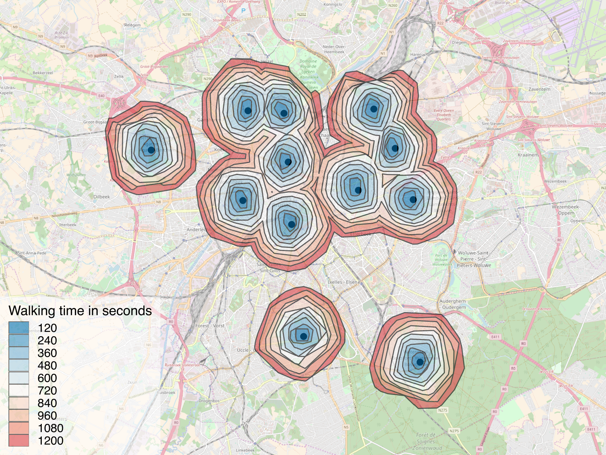

# openrouteservice\_api\_script

This repository contains python scripts for [OpenRouteService.org](https://openrouteservice.org/) API.

This script enables bypass of the API limitation of 5 locations per request. The user have to provided a shapefile (point) with locations to be used. The script will return a shapefile (polygon) with the resulting isochrones.

The total amount of locations is divided in batches of maximum 5 locations for which isochrone is retrieved. The batched resulting isochrones geometries are then aggregated and dissolved using [GeoPandas](http://geopandas.org/aggregation_with_dissolve.html).

A set of API parameters have to be chosen. More information of those parameters can be found [here](https://openrouteservice.org/documentation/#/reference/isochrones/isochrones/isochrones-service).

The user need to register on [OpenRouteService.org](https://openrouteservice.org/) and [request a token](https://openrouteservice.org/dev-dashboard/). This token should be copy-pasted in the dedicated variable in the python script in order to the latter to be able to be run.

## Example
Walking time isochrones (2 minutes each) for a set of 10 random locations in Brussels.

## Further developments
- Routing service [API](https://openrouteservice.org/documentation/#/reference/directions/directions/directions-service). 
- Distance/time matrix [API](https://openrouteservice.org/documentation/#/reference/matrix/matrix/matrix-service-(get)).